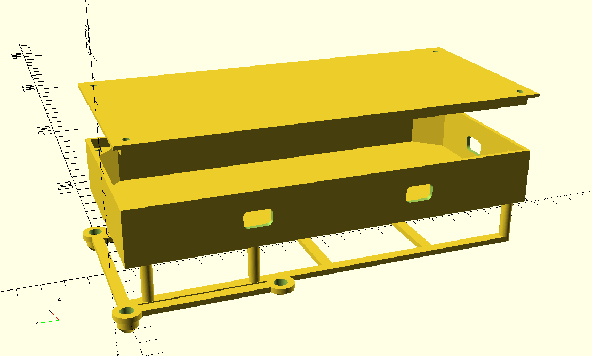

# DJI Matrice 300 Payload Box

OpenSCAD model for a DJI Matrice 300 payload box intended to hold a Raspberry Pi 5, DJI E-Port hardware, and related cabling.



The design includes:

- Matrice 300 mounting hole pattern: `78 x 66 mm`
- lower mounting frame with two rear rails
- raised payload box with cable pass-throughs
- separate screw-mounted lid with internal lip
- internal square screw pads
- color-coded OpenSCAD preview

## Files

- `djimatrice300-payload-box.scad` - main parametric OpenSCAD model
- `djimatrice300-payload-box.png` - preview image

## Key Dimensions

- M300 hole spacing: `78 x 66 mm`
- lower rear rail outer width: `71 mm`
- box outer width: `86 mm`
- box inner width: about `82 mm`
- box inner length: about `187 mm`
- vertical clearance between lower frame and upper plate: `21 mm`
- box wall thickness: `2 mm`
- lid thickness: `1.5 mm`
- M3 clearance holes: `3.2 mm`
- DJI mounting bolt seats: `6 mm` diameter, `3.5 mm` deep

The model can be exported in separate components for inspection and FDM printing:

1. full assembly preview
2. payload box
3. lower mounting frame
4. lid

Use the `part` parameter in `djimatrice300-payload-box.scad` to choose what to export:

- `part = "assembly";` - full inspection preview with the lid raised above the box
- `part = "box";` - payload box only, placed with its floor on the print bed and box-to-frame holes
- `part = "frame";` - lower mounting frame only, flipped onto its continuous top face with matching box-to-frame holes
- `part = "lid";` - lid only, flipped for FDM printing with the outer flat face on the build plate

## OpenSCAD Usage

Open the model:

```bash
openscad djimatrice300-payload-box.scad
```

Useful shortcuts:

- `F5` preview
- `F6` render
- `File -> Export -> Export as STL`

Command-line STL export:

```bash
openscad -o djimatrice300-payload-box-assembly.stl -D 'part="assembly"' djimatrice300-payload-box.scad
openscad -o djimatrice300-payload-box-box.stl -D 'part="box"' djimatrice300-payload-box.scad
openscad -o djimatrice300-payload-box-frame.stl -D 'part="frame"' djimatrice300-payload-box.scad
openscad -o djimatrice300-payload-box-lid.stl -D 'part="lid"' djimatrice300-payload-box.scad
```

## Notes

- The colored preview is for inspection only; standard STL export does not preserve colors.
- The `assembly` preview shows the split design with six M3 standoffs between the frame and box.
- The `frame` export prints upside down on the continuous top face of the lower frame, so the DJI spacers grow upward instead of starting from disconnected islands.
- The `box` and `frame` exports include matching box-to-frame holes for M3 female-female standoffs.
- Screw holes are modeled as plain cylindrical holes, not threaded.
- For plastic screws/self-tapping use, consider tuning pilot hole diameters for the chosen screw and material.
- Check cable routing and connector clearance before final printing.
